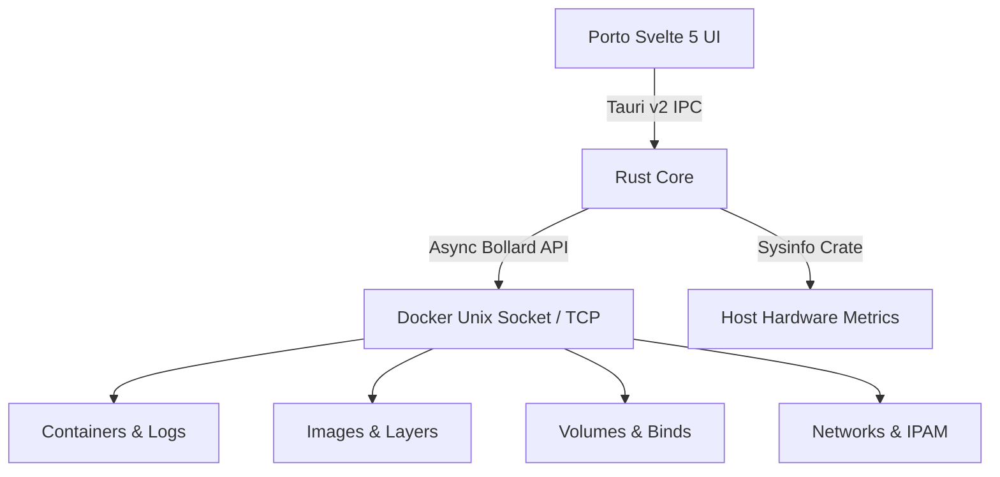

<div align="center">


# Porto

### Ultra-Lightweight, High-Performance Docker Desktop App
**Built with Svelte 5, Tauri v2, Rust & TypeScript by [BanguDevClub](https://github.com/BanguDevClub)**

[](LICENSE)
[](https://svelte.dev)
[](https://v2.tauri.app)
[](https://www.rust-lang.org)
[](https://www.docker.com)
[](https://github.com/catppuccin/catppuccin)

<p align="center">
  <a href="#features">Features</a> •
  <a href="#themes--design-system">Themes & Aesthetics</a> •
  <a href="#quick-start">Quick Start</a> •
  <a href="#build-with-docker">Build with Docker</a> •
  <a href="#architecture">Architecture</a> •
  <a href="#license">License</a>
</p>

</div>

---

## Highlights

- ⚡ **Ultra-Low Memory & CPU Footprint**: Idles at under ~30MB RAM with compile-time Svelte 5 reactivity and event-driven async streaming.
- 📦 **Complete Docker Management**: Containers, Images, Volumes, Networks, and Compose Services in one unified interface.
- 📊 **Detailed Resource Usage**: Real-time CPU %, Memory (RSS / limits), Network I/O, and Block I/O for each container, image, and service.
- 🖥️ **Host Telemetry**: Live per-core CPU load, memory distribution (Used, Available, Cached, Swap), disk partition meters, and network interface throughput.
- 🎨 **Modern Design System**: Includes **Light**, **Dark (OLED Slate)**, and all 4 official **Catppuccin** variants (**Mocha**, **Macchiato**, **Frappé**, **Latte**).
- 🔣 **Nerd Font & Font Awesome Icons**: Professional, crisp vector developer glyphs across the entire UI with zero emoji reliance.
- 🐳 **Containerized Multi-Stage Builder**: Build cross-platform Linux bundles (`.deb`, `AppImage`, binary) using `docker compose up` based on `rust:latest`.

---

## Features

### 1. Containers Manager
- Real-time status indicators (Running, Paused, Exited, Restarting).
- Live metrics per container: CPU %, RAM (used / limit / percentage), Network Rx/Tx, Block I/O, and PIDs count.
- One-click actions: Start, Stop, Restart, Pause, Unpause, Delete.
- **Slide-out Container Drawer**:
  - **Live Logs Streamer**: Search/filter inside logs, timestamp formatting, clear, copy, and download `.log` files.
  - **Interactive Exec Terminal**: Execute shell commands directly inside containers with real-time output and quick-action shortcuts.
  - **Inspect Properties**: Structured cards for IPAM addresses, port mappings, mounted storage paths, and environment variables.

### 2. Compose Projects & Services
- Automatically groups containers by Docker Compose project (`com.docker.compose.project`).
- Aggregates resource consumption and status per service.
- Multi-container service lifecycle management (Start all, Stop all, Restart service).

### 3. Images Repository
- Virtual disk size calculations, repository tags, and creation dates.
- Interactive **Pull Image** wizard with version tag selectors.
- **Run Container from Image** wizard with custom port forwards and container names.
- One-click **Prune Unused Images** with reclaimed space reporting.

### 4. Persistent Storage Volumes
- List, inspect, and estimate disk size for local and plugin volumes.
- Attached container mappings.
- **Create Volume** modal with driver and custom label support.
- One-click **Prune Volumes**.

### 5. Docker Networks Topology
- Inspect virtual bridges, overlay networks, subnets, and gateways.
- View connected container endpoints and allocated IP addresses.
- **Create Network** wizard (bridge, overlay, macvlan, ipvlan).

### 6. Host System Telemetry
- Real-time per-core CPU load and clock frequencies.
- Memory and Swap usage gauges.
- Partition storage meters (Total, Used, Available space, File systems).
- Network interface I/O rates (Received / Transmitted bytes and packets).

---

## Themes & Design System

Porto includes 6 curated themes switchable on the fly:

| Theme Name | Description | Base Palette |
| :--- | :--- | :--- |
| **Dark (OLED Slate)** | High contrast dark mode with cyan and indigo accents | `#0b0f19` / `#38bdf8` |
| **Light (Modern Slate)** | Clean, modern light theme for daytime productivity | `#f8fafc` / `#0284c7` |
| **Catppuccin Mocha** | Soothing rich dark palette with sapphire & mauve accents | `#1e1e2e` / `#89b4fa` |
| **Catppuccin Macchiato**| Medium-contrast dark pastel theme | `#24273a` / `#8aadf4` |
| **Catppuccin Frappé** | Muted dark pastel theme for reduced eye strain | `#303446` / `#8caaee` |
| **Catppuccin Latte** | Soothing pastel light theme with crisp readability | `#eff1f5` / `#1e66f5` |

---

## Quick Start

### Prerequisites
- [Node.js](https://nodejs.org) (v20+ LTS)
- [Rust](https://www.rust-lang.org) (v1.80+ with Cargo)
- [Docker Engine](https://docs.docker.com/engine/install/) running locally

### Local Development

1. **Install dependencies**:
   ```bash
   npm install
   ```

2. **Run in Web Preview Mode**:
   ```bash
   npm run dev
   ```

3. **Type-check Svelte & TypeScript**:
   ```bash
   npm run check
   ```

4. **Run Desktop Application with Tauri v2**:
   ```bash
   npm run tauri dev
   ```

---

## Multi-Target Build Pipeline (`build.sh`)

Porto includes a unified cross-platform build orchestrator [build.sh](file:///home/cassio/Documents/Code/Orgs/BanguDevClub/porto/build.sh) capable of compiling for **Linux GLIBC**, **Linux MUSL**, and **Windows**:

### Build inside Docker (Recommended)

Build all targets in an isolated container without needing local GTK / WebKit / MinGW dependencies:

```bash
docker compose up --build
```

### Build on Host

```bash
# Build all targets (Linux GNU, Linux MUSL, Windows)
./build.sh --all

# Target-specific builds:
./build.sh --linux-gnu   # Linux GNU binary & Tauri desktop bundles (.deb, AppImage)
./build.sh --linux-musl  # Linux MUSL static standalone binary
./build.sh --windows     # Windows x86_64 binary (.exe)
```

The compiled release artifacts and checksums are saved into:
```
dist-artifacts/
├── porto-linux-x86_64-gnu       (Linux GLIBC release binary)
├── porto-linux-x86_64-musl      (Linux MUSL static standalone binary)
├── porto-windows-x86_64.exe     (Windows x86_64 release binary)
├── bundle/
│   ├── appimage/                (Linux AppImage package)
│   ├── deb/                     (Debian / Ubuntu .deb package)
│   └── rpm/                     (RedHat / Fedora .rpm package)
└── SHA256SUMS.txt               (Release cryptographic checksums)
```

---

## GitHub Actions CI/CD Matrix

Automated multi-target release builds are orchestrated via native GitHub Actions runners in [.github/workflows/build.yml](.github/workflows/build.yml):

| Target Platform | Architecture | Binary / Package Output | Native Runner |
| :--- | :--- | :--- | :--- |
| **Linux (GLIBC)** | `x86_64` | `porto-linux-x86_64-gnu`, `.deb`, `.rpm`, `.AppImage` | `ubuntu-22.04` |
| **Linux (MUSL)** | `x86_64` | `porto-linux-x86_64-musl` (Static Standalone) | `ubuntu-22.04` |
| **Windows** | `x86_64` | `porto-windows-x86_64.exe`, NSIS Installer, MSI | `windows-latest` |
| **macOS (Apple Silicon)** | `aarch64` (M1–M4) | `porto-macos-aarch64`, `.dmg`, `.app.zip` | `macos-latest` |
| **macOS (Intel)** | `x86_64` | `porto-macos-x86_64`, `.dmg`, `.app.zip` | `macos-13` |
| **macOS (Universal)** | `universal2` | `porto-macos-universal` (Fat binary via `lipo`) | `macos-latest` |

---

## Keyboard Shortcuts

| Shortcut | Action |
| :--- | :--- |
| `Ctrl+K` / `⌘K` | Focus Global Search across containers, images, and volumes |
| `Ctrl+1` .. `Ctrl+8` | Navigate directly to any tab (Dashboard, Host, Containers, etc.) |
| `Escape` | Close active slide drawer or modal |
| `Ctrl+R` | Force refresh Docker telemetry |

---

## Architecture



---

## Contributing

Please review [AGENTS.md](AGENTS.md) for code style, Svelte 5 patterns, Tauri v2 architectural patterns, zero-allocation rules, and optimization guidelines.

---

## License

Porto is open-source software licensed under the **[MIT License](LICENSE)** by **BanguDevClub**.
